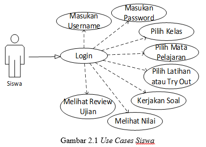
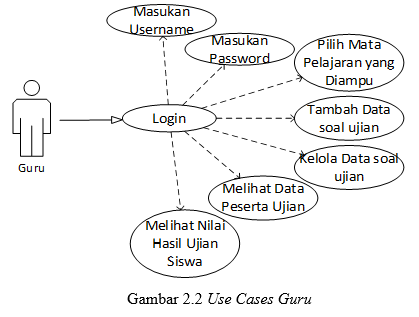
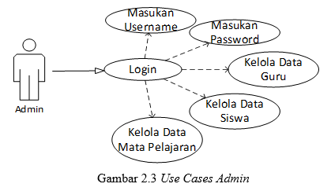

<h1 align="center" id="software-requirements-specification">DOCUMENTASI PROYEK RPL

<b>SOFTWARE REQUIREMENTS SPECIFICATIONS</b> 
"Aplikasi Ujian Online Di Sman 1 Jatibarang Berbasis Website (Uline)"
</h1>

 

    <b>Kelompok 4:</b> 
    1. Devia Suci Khoirun Nissa (1703076)  
    2. Kastuti (1703062) 
    3. Reza Pahlevi Yahya (1703069)

Kelas D3TI2C

 

 

<b>D3 TEKNIK INFORMATIKA</b> 
<b>POLITEKNIK NEGERI INDRAMAYU</b> 
<b>2019</b>

<b>
<h1>
<i>SOFTWARE REQUIREMENTS SPECIFICATIONS (SRS)</i>
</h1>
</b>

<ol>
	<li>Pendahuluan</li>
	<ol>
		1.1 Tujuan 
		1.2 Lingkup  
		1.3 Definisi, Akronim dan Singkatan 
		1.4 Referensi 
		1.5 Overview 
	</ol>
	<li> Gambaran Umum</li>
	<ol>
		2.1 Perspektif Produk 
		<ol>
			2.1.1 Antarmuka Sistem 
			<ol>
				2.1.1.1 Use Cases Siswa 
				2.1.1.2 Use Cases Guru 
				2.1.1.3 Use Cases Siswa 
			</ol>
			2.1.2 Antarmuka Pengguna 
			2.1.3 Antarmuka Perangkat Keras 
			2.1.4 Antarmuka Perangkat Lunak 
			2.1.5 Antarmuka Komunikasi 
			2.1.6 Batasan-Batasan Memori 
			2.1.7 Operasi-Operasi 
			2.1.8 Kebutuhan-Kebutuhan dalam Tahapan Adaptasi 
		</ol>
		2.2 Fungsi-Fungsi Produk 
		2.3 Karakteristik Pengguna 
		2.4 Batasan-Batasan 
		2.5	Asumsi-Asumsi dan Ketergantungan/Keterkaitan 
		2.6	Kebutuhan-Kebutuhan Penyeimbang 
	</ol>
	<li> Kebutuhan Lain yang Spesifik</li>
	<ol>
		3.1	Performa 
		3.2	Keamanan Aplikasi 
	</ol>
	<li> Informasi Pendukung</li>
</ol>
		

<b>
1. Pendahuluan 
</b>
<ol>
	1.1 Tujuan 
	<ol>Dokumen ini akan menyajikan deskripsi rinci tentang aplikasi ULine yang akan dikembangkan. Dokumen ini akan menjelaskan mengenai spesifikasi pada aplikasi ULine seperti fitur sistem, antarmuka sistem, sistem apa yang akan dilakukan, apa saja kendala pada saat aplikasi beroperasi dan bagaimana sistem akan bereaksi pada saat sedang digunakan oleh user. </ol>
	1.2 Lingkup 
	<ol>Dokumen ini menyediakan acuan untuk pengendalian tentang aplikasi ULine. Adapun ruang lingkup pembuatan aplikasi ini adalah berbasis website yang memilih fasilitas yang ada yaitu : 
		<ol>
			<li> Admin sebagai pengelola atau CRUD (Creat, Read, Update, Delete) data guru, siswa dan mata pelajaran yang ada pada fitur-fitur aplikasi ULine seperti tambah data guru, siswa dan mata pelajaran serta mendaftarkan akun guru dan siswa.</li>
			<li>Guru sebagai pengelola atau CRUD (Creat, Read, Update, Delete) data mata pelajaran yang diampu, soal ujian dan jadwal ujian yang ada pada fitur-fitur aplikasi ULine seperti tambah data soal, pertanyaan, jawaban dan jawaban benarnya serta tambah jadwal ujian.</li>
		</ol>
	</ol>
	1.3 Definisi, Akronim dan Singkatan 
	<ol>Adapun definisi dari dokumen tersebut adalah : 
		<table>
			<tr>
			   	<td>No</td>
			   	<td>Akronim</td>
			   	<td>Singkatan</td>
			</tr>
			<tr>
				<td>1</td>
			   	<td>SPMP</td>
			   	<td>Software Project Management Plan</td>
			</tr>
			<tr>
				<td>2</td>
				<td>SRS</td>
			   	<td>Software Requirements Specifications</td>
			</tr>
			<tr>
			   	<td>3</td>
			   	<td>SDD</td>
			   	<td>Software Design Document</td>
			</tr>
			<tr>
			   	<td>4</td>
			   	<td>CRUD</td>
			   	<td>Creat, Read, Update dan Delete</td>
			</tr>
			<tr>
			   	<td>5</td>
			   	<td>IEEE</td>
			   	<td>International Institute of Electronic and Electrical Engineers</td>
			</tr>
			<tr>
			   	<td>6</td>
			   	<td>ULine</td>
			   	<td>Ujian Online</td>
			</tr>
		</table>
	</ol>
	1.4 Referensi 
		<ol>
		<ol>
			<li>IEEE. IEEE Std 830-1998 IEEE Recommended Practice for Software Requirements Specifications.</li>
		</ol>
		</ol>
	1.5 Overview 
	<ol>Penulisan dokumen SRS ini dibagi menjadi beberapa bab sebagai berikut: 
		BAB I berisi pendahuluan, menjelaskan mengenai Tujuan pembuatan dokumen SRS, Lingkup, Definisi (Akronim atau Singkatan), Referensi dan Overview. 
		BAB II menjelaskan keseluruhan deskripsi dari Aplikasi ULine (Ujian Online). Deskripsi umum tersebut memberikan gambaran lengkap mengenai semua fungsi yang akan dilakukan oleh sistem. 
		BAB III berisi penjelasan detail dari masing-masing kebutuhan lain yang spesisik. 
		BAB IV berisikan tentang uraian mengenai informasi pendukung dalam pembuatan proyek Aplikasi ULine. 
	</ol>
</ol>
<b> 
2. Gambaran Umum 	
</b>
<ol>ULine merupakan aplikasi untuk mempermudah pelaksanaan ujian yang masih dilaksanakan secara manual di SMAN 1 Jatibarang. Dengan aplikasi ini siswa dapat mengerjakan soal-soal latihan dan try out  sebagai pembelajaran sebelum menghadapi Ujian Nasional Berbasis Komputer (UNBK). Latihan dan try out ini dilaksanaakan dengan mekanisme yang berbeda. Dimana try out dilaksanakan disekolah sesuai dengan jadwal yang sudah ditentukan oleh guru sedangkan latihan dapat dilaksanakan dimana saja, kapan saja dan soal dapat dikerjakan secara berulang. </ol>
	<ol>
	2.1 Perspektif Produk 
	<ol>
		Aplikasi ULine adalah aplikasi yang digunakan untuk pelaksanaan ujian secara online di SMAN 1 Jatibarang melalui website responsif yang sebelumnya menggunakan metode manual seperti ujian pada umumnya. 
		2.1.1 Antarmuka Sistem 
		<ol>
			2.1.1.1 Use Cases Siswa 
			

			2.1.1.2 Use Cases Guru 
			

			2.1.1.3 Use Cases Admin 
			

		</ol>
		2.1.2 Antarmuka Pengguna 
		<ol>
			Aplikasi ULine menggunakan antarmuka berbasis website responsif. Dimana antarmuka website responsif ini digunakan untuk admin, guru dan siswa.
		</ol>
		2.1.3 Antarmuka Perangkat Keras 
		<ol>
			<ol>
			<li>PC/Laptop</li>
			<li>Processor Core i3 or higher</li>
			<li>Penyimpanan(Hardisk) Minimal 4 GB free space</li>
			<li>Smartphone minimal android Jelly Bean or higher</li>
			<li>Monitor resolusi 1240 x 768 colors 5</li>
			<li>Keyboard dan mouse compatible with windows</li>
			</ol>
		</ol>
		2.1.4 Antarmuka Perangkat Lunak 
		<ol>
			<ol>
			<li>Windows 7 or higher</li>
			<li>Corel Draw X7</li>
			<li>Adobe Photoshop CS6</li>
			<li>Database Mysql</li>
			<li>Balsamiq Mockups 3</li>
			<li>Sublime Text 3</li>
			</ol>
		</ol>
		2.1.5 Antarmuka Komunikasi 
		<ol>
			<ol>
			<li>Paket Data</li>
			<li>Wifi</li>
			<li>Modem</li>
			<li>Smartphone</li>
			</ol>
		</ol>
		2.1.6 Batasan-Batasan Memori 
		<ol>
			<ol>
				<li>RAM yang kami gunakan adalah minimal 2 gb.</li>
				<li>Memori yang dibutuhkan aplikasi minimal 50 mb.</li>
			</ol>
		</ol>
		2.1.7 Operasi-Operasi 
		<ol>
			<ol>
			<li>Input data siswa</li>
			<li>Input data guru</li>
			<li>Input data mata pelajaran</li>
			<li>Input data soal</li>
			<li>Input data pertanyaan dan jawaban</li>
			<li>Input data jadwal ujian</li>
			<li>Update data siswa</li>
			<li>Update data guru</li>
			<li>Update data mata pelajaran</li>
			<li>Update data soal</li>
			<li>Update data pertanyaan dan jawaban</li>
			<li>Update data jadwal ujian</li>
			<li>Tampilan data peserta ujian aktif</li>
			<li>Laporan nilai ujian</li>
			</ol>
		</ol>
		2.1.8 Kebutuhan-Kebutuhan dalam Tahapan Adaptasi 
		<ol>
			Kebutuhan-kebutuhan dalam Tahapan Adaptasi yang diperlukan pada saat pengembangan aplikasi dengan menggunakan fungsi update data agar memudahkan admin dan guru dalam mengoreksi data yang salah.
		</ol>
	</ol>
	2.2	Fungsi-Fungsi Produk  
	<ol>
		<ol>
		<li>Mempermudah admin dalam mengelola data guru, siswa dan mata pelajaran.</li>
		<li>Mempermudah guru dalam mengelola data mata pelejaran yang diampu, data soal ujian beserta jawabannya, data jadwal ujian dan data nilai siswa.</li>
		<li>Mempermudah siswa dalam melaksanakan pengerjaan soal-soal latihan dan try guna mempersiapkan diri menghadapi Ujian Nasional Berbasis Komputer (UNBK).</li>
		</ol>
	</ol>
	2.3 Karakteristik Pengguna 
	<ol>
		<ol>
		<li>Pengguna mampu membaca dan menulis.</li>
		<li>Pengguna mengerti cara menggunakan smartphone dengan sistem operasi setidaknya android.</li>
		<li>Pengguna mengerti cara menggunakan PC dengan sistem operasi setidaknya windows.</li>
		<li>Pengguna mengerti cara menggunakan browser pada smartphone dan PC.</li>
		</ol>
	</ol>
	2.4. Batasan-Batasan 
	<ol>
		<ol>
		<li>Berjalan pada platform website.</li>
		<li>Sementara aplikasi ini hanya untuk SMAN 1 Jatibarang.</li>
		<li>Aplikasi ini hanya sebagai media latihan dan try out untuk para siswa dalam mempersiapkan diri menghadapi Ujian Nasional Berbasis Komputer (UNBK).</li>
		</ol>
	</ol>
	2.5. Asumsi-Asumsi dan Ketergantungan/Keterkaitan 
	<ol>
		Aplikasi ULine ini dapat dikembangkan lagi dengan memperluas sasaran ujian dimana tidak hanya untuk kelas XII tetapi juga untuk kelas X dan XI sehingga para siswa sudah memiliki pembelajaran mengerjakan soal ujian secara komputerisasi dari kelas X. Pembelajaran tersebut dapat dimulai dari pengerjaan ujian tengah semester, ujian akhir semester, kuis atau bahkan ujian harian yang berbasis komputer. 
	</ol>
	2.6. Kebutuhan-Kebutuhan Penyeimbang 
	<ol>
		<ol>
		<li>Customer Requirements Customer Requirements adalah analisis yang dilakukan terhadap pelanggan agar dapat mengetahui apa saja kebutuhan pelanggan sehingga pengembang dapat membuat sistem yang sesuai dengan kebutuhan pelanggan.</li>
		<li>Detail Requirements Detail Requirements adalah suatu analisis yang terdiri dari properti dan fungsionalitas spesifik yang diekspresikan dalam bentuk yang detail.</li>
		</ol>
	</ol>
</ol>
<b>